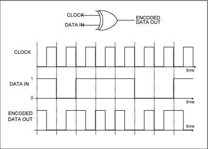

[Retornar a Tabela de Conteúdos](./)
# Camada Física

A Camada Física é como um alicerce invisível das redes de computadores, desempenhando um papel essencial na transmissão confiável de dados entre dispositivos. Ela é a primeira camada do modelo TCP/IP e também do modelo OSI (Open Systems Interconnection) e serve como a interface entre o mundo digital e o mundo físico. Sem uma sólida infraestrutura na Camada Física, toda a comunicação digital seria impossível.

Compreender a Camada Física é crucial para engenheiros de rede, administradores de sistemas e qualquer pessoa interessada em construir e manter redes eficazes e confiáveis.

## Meios de Tranmissão de Sinais
Nesta camada, se destacam os diversos meios de transmissão dos sinais. Existem diversos padrões e norma, como os diversos padrões da [IEEE](https://www.google.com/url?sa=t&rct=j&q=&esrc=s&source=web&cd=&cad=rja&uact=8&ved=2ahUKEwjIuNn51KeBAxUJg5UCHWzUCPwQFnoECAYQAQ&url=https%3A%2F%2Fwww.ieee.org%2F&usg=AOvVaw2jXR22SNQz8Aiofd5sgXaE&opi=89978449), que criam e padronizam as tecnologias WiFi, Bluetooth, ZigBee, Ethernet, dentre outros. Estes padrões garantem a interoperabilidade entre dispositivos de diferentes fabricantes. Dentre os meios de transmissão, destacam-se:
 1. Meios de Comunicação por Fio:
        . Fibra Ótica: A fibra ótica é um meio de comunicação que utiliza cabos feitos de fibras de vidro ou plástico para transmitir dados na forma de pulsos de luz. Ela oferece altas taxas de transmissão, imunidade à interferência eletromagnética e é amplamente utilizada em redes de longa distância, como a infraestrutura da internet global.
       
        . Cabos de Cobre: Cabos de cobre, como o par trançado e o cabo coaxial, são usados para transmitir sinais elétricos. Eles são comuns em redes locais (LANs) e são usados para conectar dispositivos, como computadores, a switches e roteadores.

2. Meios de Comunicação sem Fio:
        . Wi-Fi: Redes Wi-Fi usam ondas de rádio para transmitir dados sem fio. Elas são populares em ambientes domésticos e empresariais e permitem a conexão de dispositivos como laptops, smartphones e tablets a uma rede local.
        
        . Bluetooth: O Bluetooth é uma tecnologia sem fio de curto alcance usada principalmente para conectar dispositivos como fones de ouvido, teclados e mouses a computadores e smartphones.
        
        . Redes Celulares: As redes celulares, como 4G e 5G, são usadas para comunicações móveis de longa distância. Elas permitem a transmissão de voz e dados para dispositivos móveis, como telefones celulares.

3. Satélites:
        . Comunicações via Satélite: Satélites de comunicação estão em órbita ao redor da Terra e são usados para transmitir sinais de comunicação em longas distâncias. Eles são essenciais para serviços como televisão via satélite, comunicações globais e GPS.

4. Meios de Comunicação Alternativos:
        . Redes de Energia Elétrica (PLC): Em algumas aplicações, a própria rede elétrica pode ser usada para transmitir dados, uma técnica conhecida como Comunicação por Linha de Energia (PLC).

5. Meios de Comunicação Experimental:
        . Laser Point-to-Point: Em algumas situações, lasers podem ser usados para transmitir dados em linha de visão direta entre dois pontos, oferecendo alta largura de banda e segurança.

## Codificação de Sinais

A modulação e demodulação de sinais são processos essenciais na área da comunicação de dados e desempenham um papel crucial na camada física de sistemas de comunicação. Essa é a camada responsável por transmitir os bits de informação de um ponto a outro, muitas vezes através de meios físicos, como cabos de cobre, fibras ópticas ou ondas eletromagnéticas no espaço livre.

A modulação envolve a transformação de um sinal de informação, que normalmente é digital (com valores discretos), em um sinal analógico (com valores contínuos) adequado para transmissão através de um meio físico. Isso é necessário porque os meios de comunicação físicos geralmente suportam sinais analógicos, enquanto a maioria das informações que desejamos transmitir é digital. A modulação permite que esses dois domínios coexistam, tornando possível enviar dados digitais através de um meio analógico.

Por outro lado, a demodulação é o processo inverso, onde o sinal modulado é recuperado no receptor e transformado de volta em um sinal digital compreensível. Isso é essencial para que o destinatário decodifique corretamente os dados transmitidos e os interprete de acordo com o formato original.

A modulação e demodulação desempenham um papel fundamental em uma variedade de tecnologias de comunicação, desde a transmissão de rádio e televisão até redes de computadores e sistemas de telefonia móvel. Esses processos são a espinha dorsal da camada física da comunicação de dados e permitem a transmissão confiável e eficaz de informações em todo o mundo. Portanto, entender como a modulação e demodulação funcionam é essencial para qualquer pessoa que queira compreender o funcionamento interno dos sistemas de comunicação modernos.

### Prática de codificação de sinais

Neste diretório, se encontra um código que demonstra como um dado é codificação utilizando codificação Manchester. A codificação Manchester é uma técnica fundamental na área da comunicação digital e que desempenha um papel crucial na transmissão de dados confiáveis ​​entre dispositivos eletrônicos. Criada na década de 1940, essa técnica de codificação foi desenvolvida com o objetivo de garantir uma transmissão precisa de informações, especialmente em ambientes suscetíveis a interferências e ruídos.

A principal característica da codificação Manchester é a representação de cada bit de dados por meio de transições de sinal entre dois níveis, geralmente de baixo para alto e vice-versa. Essas transições ocorrem no meio de cada período de bit, tornando-a uma codificação de **transição de fase**. Isso significa que a presença ou ausência de uma transição em um determinado ponto no tempo representa um valor binário específico, geralmente 0 ou 1, conforme pode ser visto na imagem abaixo:

Uma das vantagens cruciais da codificação Manchester é a capacidade de fornecer uma sincronização confiável entre o transmissor e o receptor, garantindo que ambos estejam em sintonia em relação ao início de cada bit. Isso torna a codificação Manchester especialmente útil em aplicações que requerem alta precisão e resistência a interferências, como comunicações em redes Ethernet, sistemas de controle industrial e diversas aplicações de telecomunicações.